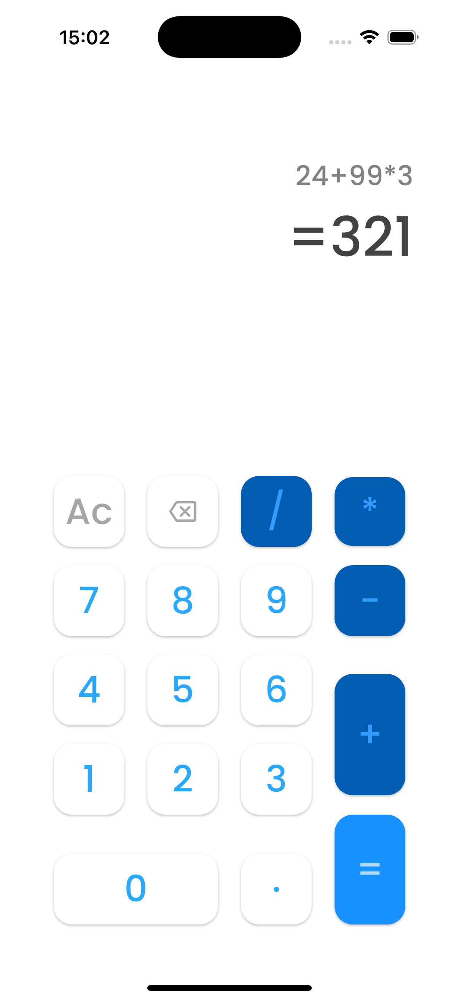

# 📱 Port Calculator

Um aplicativo de **calculadora** desenvolvido em **Flutter**, seguindo princípios de **Clean Architecture**.
O projeto utiliza **Cubit (Bloc)** para gerenciar estado e organiza a estrutura em camadas claras, facilitando manutenção e testes.

---

## ✨ Funcionalidades
- Operações básicas: **soma, subtração, multiplicação, divisão**.
- Suporte a **números decimais**.
- Botões de **limpar (AC)** e **backspace**.
- Avaliação da expressão usando **math_expressions**.
- **Tema Light e Dark** aplicados ao design.
- Estrutura preparada para **testes unitários**.

---

## 📂 Arquitetura
O projeto segue uma abordagem **por feature**, com separação entre:
- `config/` → temas e configurações globais.
- `features/calculator/` → lógica e apresentação da calculadora:
  - `bloc/` → estado e cubit.
  - `pages/` → telas principais.
  - `widgets/` → componentes reutilizáveis.

---

## 🧪 Testes
Testes unitários foram implementados com **bloc_test** para validar:
- Entradas de dígitos, operadores e decimais.
- Avaliação de expressões.
- Casos especiais (divisão por zero, substituição de operadores, etc.).
- Comandos de **AC** e **Backspace**.

Para rodar os testes:
```bash
flutter test
````

🖼️ Screenshots

🌞 Tema Light


🌙 Tema Dark

